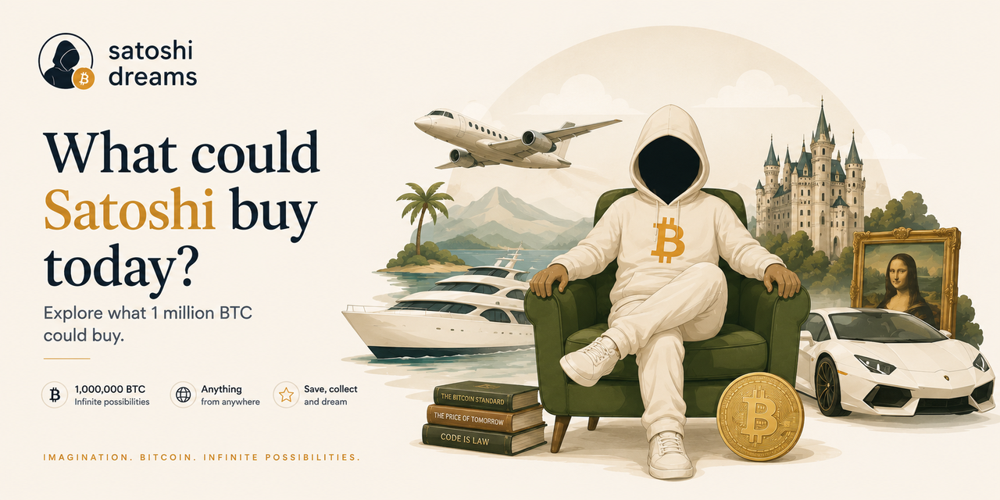

# Satoshi Dreams

> What could Satoshi buy today?

Satoshi Dreams is an open source visual experiment imagining what could happen if Satoshi Nakamoto suddenly came back with access to the legendary 1 million BTC.

Planes. Countries. Football clubs. Castles. Rockets. Entire companies. Ridiculous things. Beautiful things.

This project transforms the scale of Bitcoin into a playful and shareable exploration experience.

## What is this?

Satoshi Dreams is not a financial simulator.

It is a satirical and artistic project inspired by internet culture, Bitcoin mythology, design, and imagination.

Users can explore absurd purchases, save personal collections locally in the browser, and share them with friends.

## Features

- Explore iconic and absurd items
- Save personal collections locally
- Beautiful editorial-style illustrations
- Shareable item pages
- Open source and community-driven
- Multi-language support

## Categories

- Countries
- Islands
- Cars
- Rockets
- Art
- Football clubs
- Cities
- Jets
- Yachts
- Completely absurd ideas

## Philosophy

Bitcoin belongs to internet culture.

Satoshi Dreams does too.

## Open Source

Contributions are welcome.

You can help by:

- adding new items
- improving illustrations
- translating content
- fixing UI details
- improving accessibility
- proposing absurd ideas

## Disclaimer

This project is fictional, satirical, and artistic.

Nothing here should be interpreted as financial advice or real valuation data.

## License

MIT
